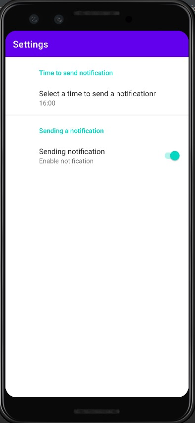

# ContactPro
An application used to manage contacts with extensive features.
This  project presents a contact management application with advanced features. Users can add contacts along with their photos, email address, residential address, and even have the option to block contacts from calling. Furthermore, users can also insert notes to add important details, such as the most convenient time to call. Additionally, the app offers the ability to add a birthday date to a contact and save it in the calendar, which automatically sends a reminder on the contact's birthday.
Within the settings menu, users have the option to enable or disable birthday notifications and set the specific time for the notifications to appear

    

The application also boasts an intuitive interface, with a screen that displays a list of all the saved contacts. When a user clicks on a contact, they can easily view all the details related to that contact. One of the unique features of this app is that users can enter a contact's address, and when they click on it, the application automatically switches to Waze with the contact's address. This seamless integration makes it easier for users to navigate and find the contact's location.

